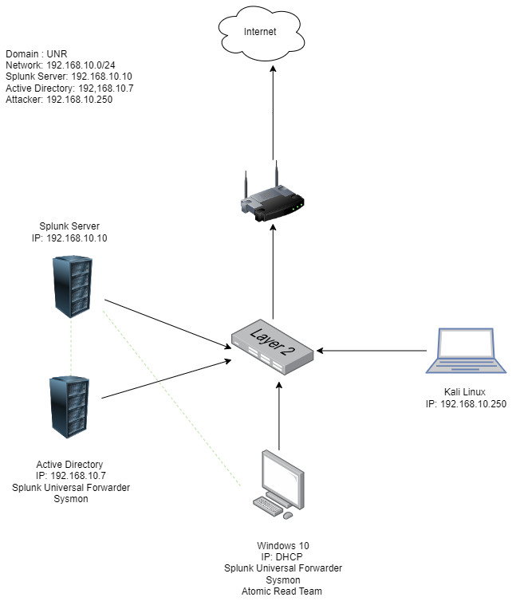

# Active-Directory
# Active Directory Lab Project

This project aims to set up a virtualized environment using **Oracle VM VirtualBox** that includes various systems like **Windows 10**, **Kali Linux**, **Windows Server**, and **Ubuntu Server**. The setup focuses on networking, security, and automation, using **Splunk** for log analysis, **Sysmon** for endpoint monitoring, and testing with tools like **Crowbar** and **Atomic Red Team (ART)**. The goal is to provide a practical learning platform for cybersecurity concepts, tools, and techniques in a controlled virtual environment.

## Objectives
The goal is to provide hands-on experience in cybersecurity through the following tasks:
- Creating and configuring virtual machines (VMs) such as Windows 10, Windows Server, Kali Linux, and Ubuntu Server.
- Configuring network communication and ensuring machines can communicate via IP addresses using **NAT Networks**.
- Implementing security measures like installing **Splunk** for log analysis, **Sysmon** for endpoint monitoring, and performing security testing with **Crowbar** and **ART**.
- Automating tasks with **PowerShell scripting**.
- Adding Windows machines to an **Active Directory domain** and enabling **Remote Desktop**.
- Simulating and analyzing security attacks using logs from Splunk.

## Skills Developed
- Setting up VMs in **Oracle VM VirtualBox**.
- Network configuration using **NAT Networks** and troubleshooting (e.g., ping, DNS settings).
- Installing and configuring **Splunk** and **Sysmon**.
- Simulating attacks with **Crowbar** and **ART** for security testing.
- Log analysis with **Splunk** using event codes such as 4625 and 4624.
- Automating tasks with **PowerShell scripts**.
- Joining Windows machines to **Active Directory** and enabling **Remote Desktop**.

## Tools Used
- **Oracle VM VirtualBox Manager** for managing virtual machines.
- **Splunk Server** for log analysis and monitoring.
- **Splunk Universal Forwarder** for data forwarding to Splunk.
- **Sysmon** for monitoring endpoint activity.
- **Crowbar** for brute force attack simulation.
- **Atomic Red Team (ART)** for running security tests.
- **PowerShell** for automation and scripting.
- **Windows Server 2022** for managing Active Directory.
- **Ubuntu Server** to run the Splunk server.
- **Kali Linux** as the attacker machine for penetration testing.

## Steps to Set Up

### Part 1: Virtual Machine Installation
1. **Install Oracle VM VirtualBox Manager**: Download and install from the [official website](https://www.virtualbox.org/).
2. **Install Windows 10**: Download and set up using the ISO from [Microsoft](https://www.microsoft.com/en-ca/software-download/windows10).
3. **Install Kali Linux**: Get the VM image from [Kali](https://www.kali.org/), extract it, and import it into VirtualBox.
4. **Install Windows Server 2022**: Download and install from [Microsoft](https://www.microsoft.com/en-us/evalcenter/evaluate-windows-server-2022).
5. **Install Ubuntu Server**: Download from [Ubuntu](https://ubuntu.com/server), and install it for use as a Splunk server.

### Part 2: Network Configuration
1. **Configure NAT Network**: Set up a NAT network in VirtualBox with an IP range of `192.168.10.0/24`. 
2. **Set Static IP for Ubuntu Server**: Modify the netplan configuration for a static IP of `192.168.10.10/24`.
3. **Install Splunk on Ubuntu**: Install Splunk Enterprise and configure it to start on boot.
4. **Configure Windows IP Settings**: Set static IPs for Windows machines and connect them to the NAT network.
5. **Install Sysmon and Universal Forwarder**: Install these tools on Windows machines for log forwarding and monitoring.

### Part 3: Active Directory and Domain Setup
1. **Set Up Active Directory Domain Services**: On Windows Server, install AD DS, create a new domain `demodomain.local`, and promote the server to a domain controller.
2. **Join Windows 10 Machine to Domain**: Connect the Windows 10 machine to the Active Directory domain and verify login using domain credentials.

### Part 4: Simulate Brute Force Attack
1. **Kali Linux Setup**: Configure the network, install **Crowbar**, and prepare wordlists for brute force attacks.
2. **Enable Remote Desktop on Windows 10**: Allow Remote Desktop connections and add users for testing.
3. **Execute Brute Force Attack**: Use Crowbar to perform a brute force attack on the Windows 10 machine.
4. **Analyze Logs with Splunk**: Investigate failed login attempts and detect brute force activity by reviewing event codes in Splunk (`EventCode=4625`).

## Conclusion
This lab provides a comprehensive hands-on experience in setting up a secure virtualized environment, configuring Active Directory, and simulating and analyzing cybersecurity attacks. The project builds proficiency in networking, security tools, scripting, and log analysis using a variety of industry-standard tools and techniques.
